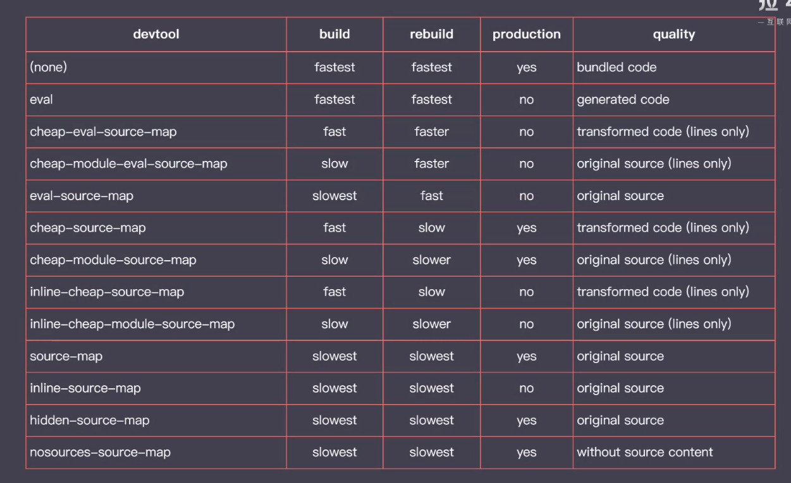

### webpack

- source map
```
引入.map文件
写入注释
//# sourceMappingURL=jquery-3.4.1.min.map
```
- 在webpack中使用
```
// webpack.config.js
devtool: 'soure-map'
```
- webpack 支持soureMap的方式有很多



```
// eval模式 看到的代码是打包之后的模块代码 构建速度最快，代码清晰度差
devtool: 'eval'
// eval模式 看到的代码是打包之后的模块代码 构建速度最快，代码清晰度差
devtool: 'eval'
```